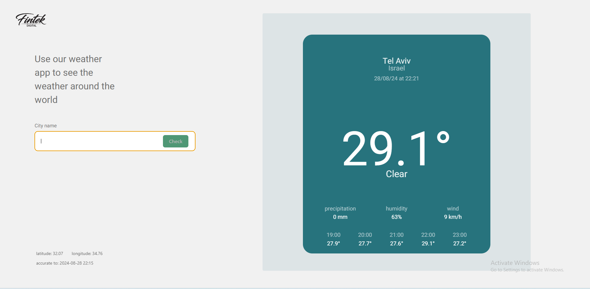
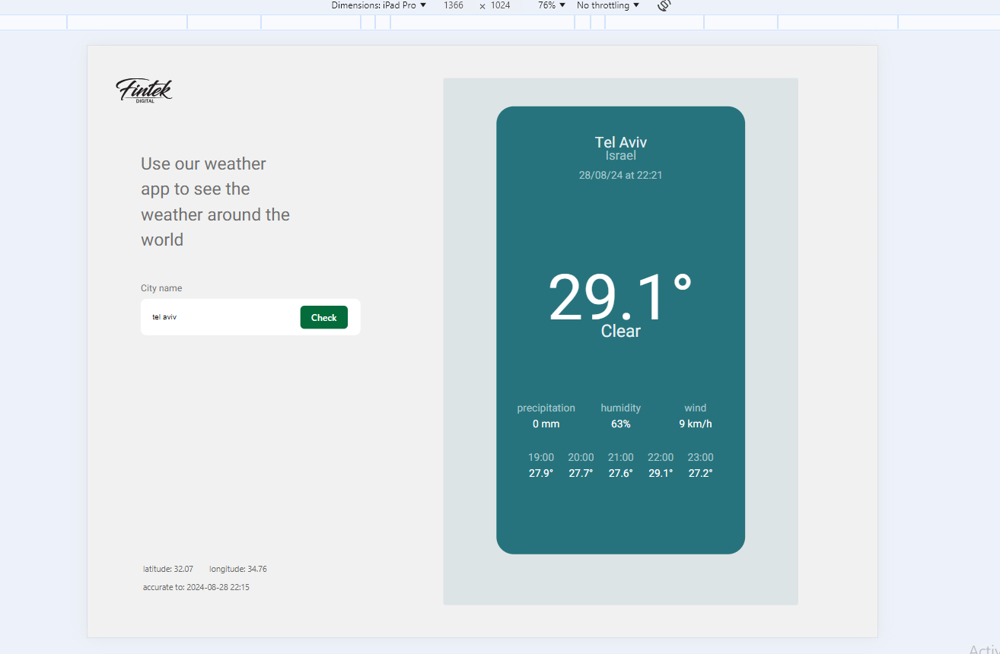
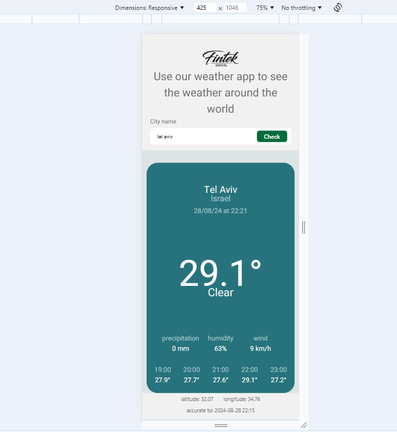

# Weather App

This project is a weather application that allows users to search for historical weather data for a specific city. The application is built using Node.js for the backend and React with Vite for the frontend.

## Table of Contents

- [Installation](#installation)
- [Usage](#usage)
- [API Endpoints](#api-endpoints)
- [Components](#components)
- [Contributing](#contributing)
- [License](#license)

## Installation

To install and run the project locally, follow these steps:

1. Clone the repository:
    ```bash
    git clone https://github.com/yourusername/weather-app.git
    cd weather-app
    ```

2. Install backend dependencies:
    ```bash
    cd backend
    npm install
    ```

3. Install frontend dependencies:
    ```bash
    cd ../frontend
    npm install
    ```

4. Start the backend server:
    ```bash
    cd ../backend
    npm start
    ```

5. Start the frontend server:
    ```bash
    cd ../frontend
    npm run dev
    ```

## Usage

To use the application, open your web browser and navigate to `http://localhost:3000`. Enter the name of the city you want to search for historical weather data and click the "Check" button.

Here are some screenshots of the application:

### Desktop Screen


### Tablet Screen


### Smartphone Message



## API Endpoints

The backend server exposes the following API endpoints:

- `GET /api/weather/history?city={city}&date={date}`: Retrieves historical weather data for a specific city and date.

## Components

The main components of the application are:

- `CitySearch`: A component that allows users to search for historical weather data by city name.
- `WeatherCard`: A component that displays the historical weather data for the selected city.

## Contributing

Contributions are welcome! Please follow these steps to contribute:

1. Fork the repository.
2. Create a new branch (`git checkout -b feature-branch`).
3. Make your changes.
4. Commit your changes (`git commit -m 'Add new feature'`).
5. Push to the branch (`git push origin feature-branch`).
6. Open a pull request.

## License

This project is licensed under the MIT License. See the [LICENSE](LICENSE) file for details.